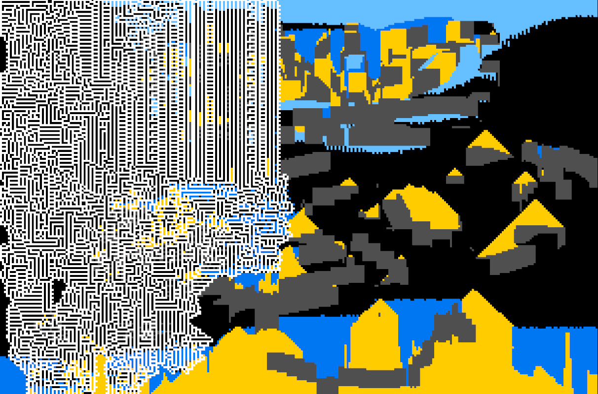

# Sandbox

A noita-like elemental particle game made in Rust.
Sort of like Powder Game. Use the 'z', 'x', and 'c' keys to change between water, sand, and stone.
Press left and right brackets to change the brush size.




## How to run

Ensure you have Rust installed. If not, you can install it from [here](https://www.rust-lang.org/tools/install).

```bash
git clone https://github.com/svader0/sandbox.git
cd sandbox
cargo run --release
```
